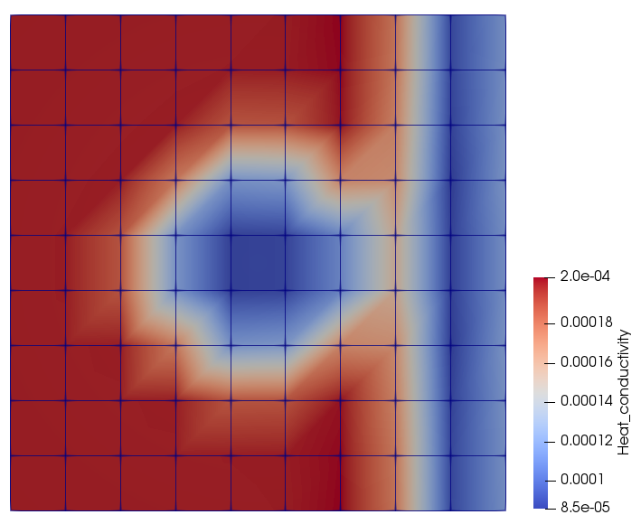

# SiSc Lab Group 2 project

****Parameter Estimation of Heat distribution in Heterogeneous Media****

To run the code do the following

1.  export NAG key:
* export NAG_KUSARI_FILE=(address of the 'sisc_lab_project-master' folder)/nag_key.txt

2. Build:
*  mkdir build
*  cd build
*  mkdir vtk
*  cmake ..
*  make

3. Run main:
*  ./main

4. Run tests:
*  ./test_solve

*Note:*\
Change the test cases as required in the `main.cpp` file.
	
1. `case_1.json` Single diffusitivty
2. `case_2.json` Dual diffusitivty
3. `case_3.json` Triple diffusitivty

Results:

1. Case 1

2. Case 2

3. Case 3

	
Authors:

*  Muhammad Sajid Ali
* Shubhaditya Burela
* Aneesh Futane
* Pourya Pilva

Supervisors:
* Leppkes Klauss
